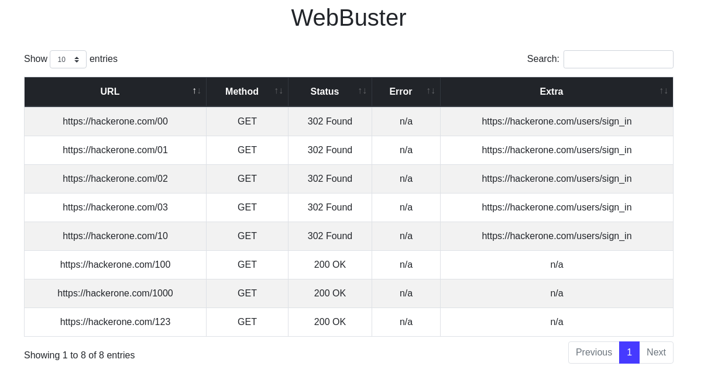

# webbuster

Web app to visualize [Rustbuster](https://github.com/phra/rustbuster)'s output.

## Installation

Download a pre-built binary from [Releases](https://github.com/joanbono/webbuster/releases) or compile:

```bash
go get -u -v github.com/joanbono/webbuster
go install -v github.com/joanbono/webbuster
```

## Usage

```bash
# From rustbuster
$ rustbuster dir -w dictionary.txt -u https://target.com -o sample.json

# From webbuster
$ webbuster -data sample.json

[+] WeBBuster -  Listening on http://localhost:9090...
``` 

Open your browser on [http://localhost:9090](http://localhost:9090).

